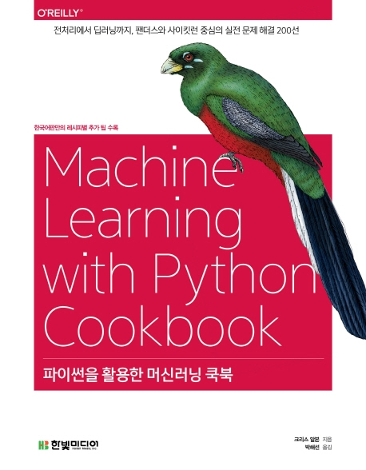

# 파이썬을 활용한 머신러닝 쿡북

2019년 5월 출간, 길벗 출판사

이 책은 크리스 알본(Chris Albon)이 쓴 아마존 베스트 셀러 "[Machine Learning with Python Cookbook](https://www.amazon.com/Machine-Learning-Python-Cookbook-Preprocessing/dp/1491989386/)"의 번역서입니다. 넘파이, 판다스부터 사이킷런, 케라스까지 다양한 머신러닝 작업에 필요한 핵심 조리법을 알차게 담고 있습니다. 508 쪽 모두 컬러 인쇄입니다! 레시피에서 다루지 못한 내용은 추가로 역자가 '덧붙임'으로 보완하였습니다. 필요할 때마다 꺼내서 확인하는 이 쿡북은 "[파이썬 라이브러리를 활용한 머신러닝](https://tensorflow.blog/개정판-파이썬-라이브러리를-활용한-머신러닝/)"과 찰떡 궁합입니다!

번역서에 관한 궁금한 점이나 오류가 있다면 깃허브에 이슈를 남겨 주시거나 [블로그](https://bit.ly/ml-cookbook)를 통해 알려 주세요.

테스트 환경: Python 3.7, numpy 1.16.2, scikit-learn 0.21.2, pandas 0.24.2, keras 2.2.4

감사합니다!